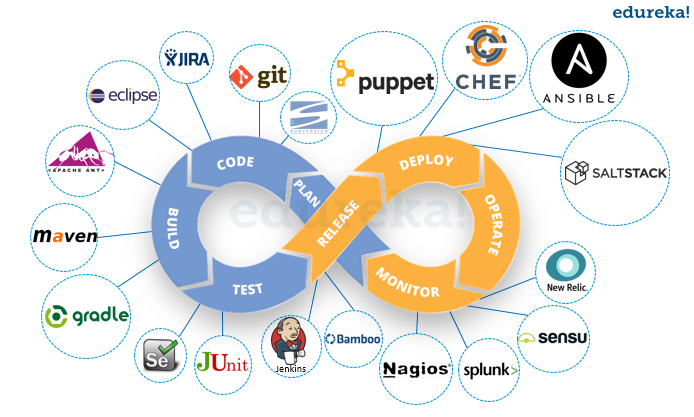

# Day 1 - 前言

身為一個 Operations 出身的工程師，過去幾年我一直認為自己是 IT 界的黑手，Ops 對於企業來說是一個不可或缺的職位，要上線、要佈署總是要等待大家都下班後才能默默的執行，凡事跟科技有關係的東西不懂就先問 Ops，有插電的就是你的啦！！

---

## 資訊業黑手之路

對於企業老闆來說這個職位無法替公司帶來利益，可是裁掉的話公司又無法營運，當網站活的好好的這絕對是應該的 (慣老闆：你沒動他為什麼會壞？)，然而出問題的時候 Ops 總是要第一線 On Call 站出來 Debug，如果沒修好就不是只有手黑而已，連臉都黑了，這時候又會出現 "慣老闆：那個某某某為什麼網站又不能動了。"、"Developer：我昨天上線的時候不是好好的嗎？我在我的電腦測試 OK 的阿！"，然後就默默又揹了黑鍋，多數身為 Ops 職位的工程師或多或少都會感受到這樣的感覺。

然而 Ops 重複性質的工作項目隨著科技規模龐大也開始越來越多，每有新專案地基都大同小異，在這樣的性質下做了三年，開始對於人生有了警訊，在這樣下去終究只是個黑手。

從一開始嘗試自己用 script 來把這些事情重複性質的工作做完，終於開始享受到有時間可以去讀一些除了 Ops 以外的東西 (i.e Database、Infosec、Coding)，但是隨著專案越來越龐大，這些 script 也越來越複雜，隨著維護工作越來越艱難，跟開發團隊的鴻溝也越來越深，開始陷入工作的瓶頸中。

---

## DevOps 文化的覺醒

那時我剛進入現在的公司並且當時正開始推行 DevOps 文化，在 DevOps 文化建立初期非常艱難，企業既有的人文與文化非常重要，在一間很有年資的企業無法喊喊口號就能開始 DevOps，但這時我非常慶幸是一位 Ops，因為身為一位 Ops 你很容易跟 Developer、DBA、InfoSec .. 等等團隊進行 co work，從這樣的部門角色很容易可以把觸手伸到(誤)到各單位，推廣 DevOps 是一件很有效的方式 (當然也需要權力及制度的推力)

從導入 DevOps 文化中我開始了解到，推行 DevOps 最直接的方式就是把 Dev 和 Ops 的工作都攪在一起，擁有相同的思維、共通的目標就不會讓鴻溝加深，最直接的方式就是 **CI / CD** 與  **自動化**，但是身為 DevOps 的推廣者怎麼可以空口說白話呢，一定要有一些具體的事蹟才能說服其他人，所以在 2017 年初我開始接觸了 Puppet，要做就先從解決自己的問題開始 ...
