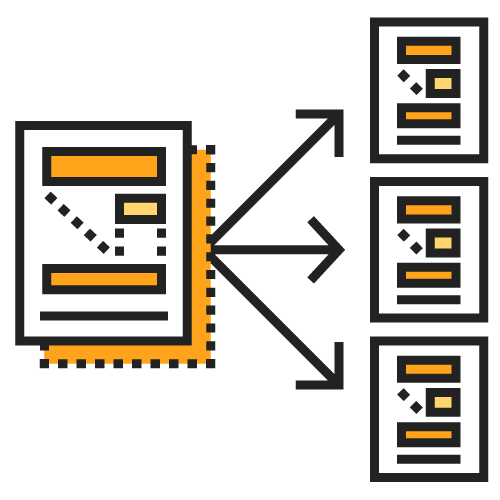

# Day 2 - Puppet 是什麼？能吃嗎？

Puppet ? 拿去餵 Google 翻譯就是「木偶」阿 (誤)！！，今天要講的 Puppet 不是木偶啦，而是 2005 年出品的老牌自動化組態管理工具 Puppet，起源由一位長期待在 Data Center 上班的工程師 [Luke Kanies][luke-kanles] (創始人) 對於現狀的不滿所以開始寫 Puppet。 

## 時代變遷讓整個 infrastructure 的防守範圍擴大

過去 Luke Kanies 認為 Server 即是整個服務的一切。

> "Servers used to be the center of everything."

當 Internet 發展的快速，服務開始變得龐大，你的服務不只有單一程式語言，還有很多不同類型的 Server 來提供服務。

> "Applications are increasingly complex and distributed, and you can't just consider one node"

## 可被記錄及可視化的 infrastructure

這時你要看的不只是單一 Server，而是整個 infrastructure，所以一個容易讓人看懂的 infrastructure 開始變得重要。

> "What's needed is a single abstraction and view of the entire data center infrastructure."

## 時間就是金錢，減少你的工作時間，去做你想做的事情。

當時的 Luke Kanies 對於做重複性工作非常不滿，他認為人腦應該拿來做更困難的事情，讓「自動化」來完成簡單且過雜的事物後，人們可以做更多想做事情。

## 龐大的使用者經驗

從 Startup 到財富 100 大企業中佔有 75% 的比例都使用 Puppet，他們都用了你還怕什麼 ?!

> From startups to 75% of the Fortune 100, thousands of companies rely on Puppet.

最具代表性的其一就是 [Github](https://github.com) 並且維護大量 Puppet modules，面對技術主管你可以說 Github 來說服，面對老闆可以說「美國銀行跟證券交易所」也在用 Puppet。

從 2016 年底才開始接觸 Puppet 的我，突然大悟原來老美在 2005 年就在搞 infrastructure as code 了阿，瞬間覺得好落後阿 XDDD ..

[luke-kanles]: https://puppet.com/company/leadership/luke-kanies