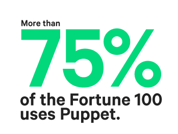
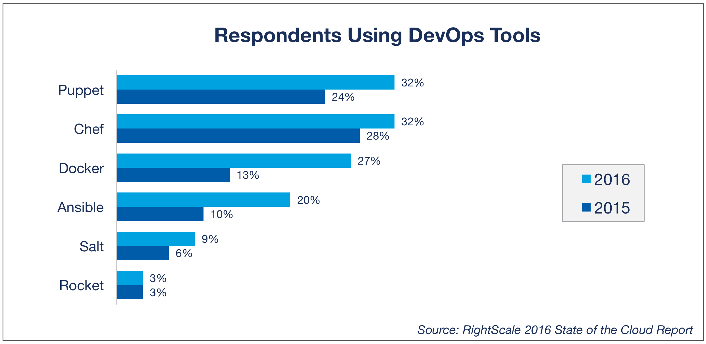
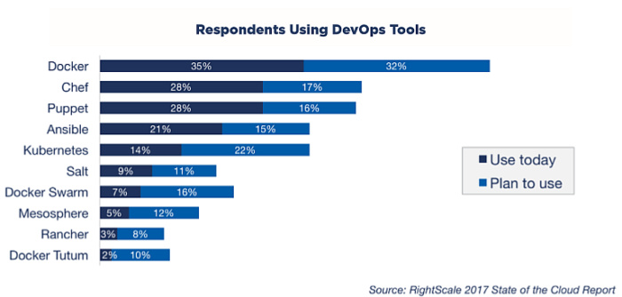
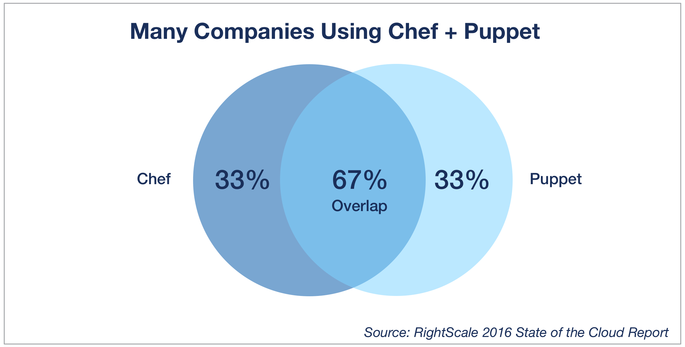

# Day 2 - Puppet 是什麼？能吃嗎？

本系列文資料可參考以下：

- [Github](https://github.com/shazi7804/ops-puppet-30-days)
- [Gitbook](https://gitbook.com/book/shazi7804/puppet-manage-guide/details)
- [Mr.沙先生](https://shazi.info)

---

Puppet ? 拿去餵 Google 翻譯就是「木偶」阿 (誤)！！，今天要講的 Puppet 不是木偶啦，而是 2005 年出品的老牌自動化組態管理工具 Puppet，起源由一位長期待在 Data Center 上班的工程師 [Luke Kanies][luke-kanles] (創始人) 對於現狀的不滿所以開始寫 Puppet。 

## 時代變遷讓整個 infrastructure 的防守範圍擴大

過去 Luke Kanies 認為 Server 即是整個服務的一切。

> "Servers used to be the center of everything."

當 Internet 發展的快速，服務開始變得龐大，你的服務不只有單一程式語言，還有很多不同類型的 Server 來提供服務。

> "Applications are increasingly complex and distributed, and you can't just consider one node"

## 可被記錄及可視化的 infrastructure

這時你要看的不只是單一 Server，而是整個 infrastructure，所以一個容易讓人看懂的 infrastructure 開始變得重要。

> "What's needed is a single abstraction and view of the entire data center infrastructure."

## 時間就是金錢，減少你的工作時間，去做你想做的事情。

當時的 Luke Kanies 對於做重複性工作非常不滿，他認為人腦應該拿來做更困難的事情，讓「自動化」來完成簡單且過雜的事物後，人們可以做更多想做事情。

## 龐大的使用者經驗

從 Startup 到財富 100 大企業中佔有 75% 的比例都使用 Puppet，他們都用了你還怕什麼 ?!

> From startups to 75% of the Fortune 100, thousands of companies rely on Puppet.

## 為什麼是用 Puppet 而不用 Chef, Ansible

總是覺得相同類型的工具只要選一樣來搞就好了，因為這世界實在太多黑科技了，你根本沒辦法每一樣都學會，所以在挑選的時候每一套工具我都會淺淺的入門後再做決定，但是在做決定時，會有幾個主要的因素影響我：

### 市佔率

在 2016 年和 Chef 並駕齊驅為 32%，而目前台灣最熱門的 Ansible 緊追在後

在 2017 年至今排名被 Docker 遠遠超過，但是在組態管理工具來說沒有差異太大。

當你無法評估或猶豫不決的時候，市佔率是一項可以說服主管、說服老闆很簡單的東西，當你選擇市佔率比較高的資源時，你會占有以下優勢：

- 網路資源多，有人用就會有人記錄，人一多什麼奇淫技巧都出現了。
- 人力資源多，使用的人多，招募就好找。

先說用 Puppet 最具代表性的其一就是 [Github](https://github.com) 並且維護大量 Puppet modules，連 Github 都在用的好工具不用嗎？不過當然也不能有品牌迷思啦，在這時候真的要理性一點 XDD ..

### 需求

選擇工具時最主要還是看需求，因為我身在的企業有著相當複雜的環境，所以在選擇組態工具時能夠符合各種環境彈性調整絕對是首選，在這塊 Puppet 和 Chef 都能輕鬆的達到目前環境的需求，並且針對大幅 Scale 能簡單的處理。

### 成本

如果前兩項都達到了，那麼就要開始思考要花費多少時間成本在這套工具，總不能玩個一年還跟他 5 分熟吧 XDD，在這塊針對 Puppet、Chef、Ansible 我自己定義是：

- 開發者最愛 Chef，因為編寫起來使用 Ruby 語言居多，所以習慣 Coding 的人會比較好上手。
- 系統管理者最愛 Ansible，大部分系統管理者具備 Coding 能力較少，Ansible 在這塊整合的很好，對於 Ops 上手簡單。
- Puppet 介於 Chef 和 Ansible 之間則是 Dev 和 Ops 各半，但和 Chef 是比較同類型的工具。

也由於 Puppet 和 Chef 的使用上頗相近，很多企業也採用 Puppet + Chef 來彌補各自的缺陷。

結論是沒有一定要使用某一項工具最好，而是適合你自身的環境、適合自己，最後的目的有達成就是好工具！

[luke-kanles]: https://puppet.com/company/leadership/luke-kanies
