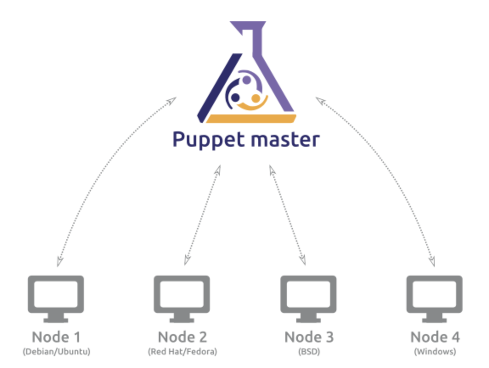
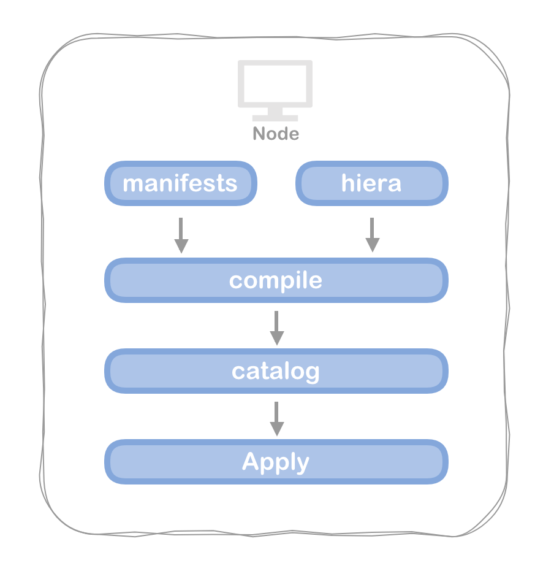
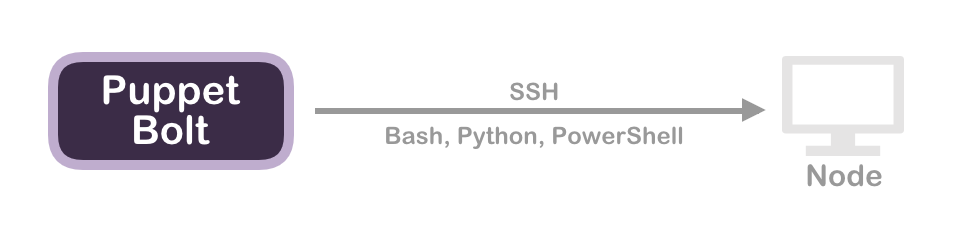

# Day 3 - Puppet 的架構

前面兩天講了不怎麼技術的廢話之後，終於要在以下的 27 天會有比較"技術性"的語言了啊 ...

因為我習慣了解一個新事務時先從最簡單的開始看起 XDD，所以第三天我打算先來談談 Puppet 的整體架構，這樣看起來比較不容易放棄 ...

## Master / Agent

基於 `pull-based` 的架構 (官方建議)

Puppet 的 Master / Agent 架構通常適用於有規模的環境佈署，由 Puppet Master 提供 configuration，在每台要被佈署的 Node 安裝 Puppet agent 向 Master 獲取 configuration。

Puppet Master 通常由 N + 1 台 Puppet Server 構成，必須要能夠承受所有的 Puppet agent 訪問，而 Puppet agent 通常透過 service 運行或是 cron 來定期向 Puppet Master 更新 catalog。

Agent 透過 catalog 更新完畢後，將 report 回傳給 Puppet Master。

## Masterless

基於 `push-based` 的架構

無 Master 又稱獨立佈署的架構，透過 `Puppet apply` 進行單機佈署的方式達成。

Masterless 很常被應用於 Docker or Vagrant 等 image 環境使用，通常適用於數量少的環境。

## Tasks and Plans

Puppet tasks and plans 是 puppet 推出基於 `push-based` 的一次性的臨時佈署，與 Ansible 的方式相似，彌補 Puppet 長期以來使用 `pull-based` 必須等待 deploy time 的缺點。

可以使用 [Bolt](https://github.com/puppetlabs/bolt) 開源專案或是企業版的 Puppet Enterprise Task Management (available in Puppet Enterprise 2017.3) 來實現 Tasks and Plans。

## 不負責碎碎念

佈署架構上主要分為三種，每個佈署的方式都適應不同的場景，從能適應**超大型架構**的 Master / Agent 架構和常用在 Images 的 Masterless 架構，或是最近才剛出的 Tasks and Plans 用來解決臨時性的需求，Puppet 在這些階段都算是都有解決方案了。

經過時間的演變，Puppet 不再是以前那個老牌頑固不變的組態工具，從這幾年可以看到 Puppet 有聽到使用者的聲音而做了改變，現在變化的作法更多也更廣。

[puppet-tasks-and-plans]: https://puppet.com/blog/easily-automate-ad-hoc-work-new-puppet-tasks
