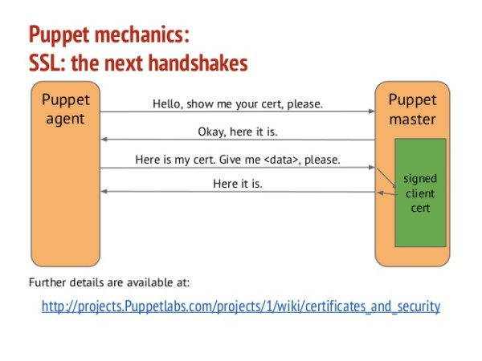

# Day 7 - MASTER 和 AGENT 的認證關係


Puppet Master 和 Agent 是使用 CA 憑證來產生 SSL Cert 進行溝通

```
               +------------------------+
               |                        |
               |  Root self-signed CA   |
               |                        |
               +------+----------+------+
                      |          |
           +----------+          +------------+
           |                                  |
           v                                  v
  +-----------------+                +----------------+
  |                 |                |                |
  | Server SSL Cert |                | Agent SSL Cert |
  |                 |                |                |
  +-----------------+                +----------------+
```

CA 憑證可以是由外部頒發，或是自簽 CA，但通常會直接讓 Puppet 自簽 Internal CA，如果你用的是 Internet CA 則必須停用 Internal CA。

整個認證的交易就和我們一般 HTTP 的 SSL 申請狀況相同，Agent 就像是一般企業客戶端，而 Master 就是 CA 憑證中心。



1. 由 Agent 向 Master 發起憑證簽署需求 (CSR)
1. 由 Master 依照 Agent 提供的 CSR 簽署一份 SSL 憑證提交給 Agent
1. 由 Master 起的 CA 憑證底下皆信任所有簽署過的 CSR
1. Master 的 CA 憑證並不需要外部憑證信任，使用 local CA 信任
1. 整個的 SSL 的交易過程就像是我們向憑證中心交易的過程，只不過 HTTPS 是 trust internet，而 Puppet 是 trust local。


然而 Agent 交付給 Master 需要經過 Master 的同意，簽署的方式分為：

- 手動簽署 (Signing) 
- 自動簽署 (Naive Autosigning) 
- 白名單簽署 (Basic Autosigning)
- 依照政策的簽署 (Policy-based Autosigning)
- 透過 API 簽署 (Policy executable API)

## 自動簽署 (Naive Autosigning)

在自動簽署中是最不安全的簽署方式，當使用 Naive Autosigning 的話，所有的 Agent CSR 要求皆會自動同意簽署，這並不適合用在正式環境，但相對的用於測試環境是非常方便。

設定自動簽署你只需要在 puppet.conf 的 [master] 中加入 autosign = true

```shell
$ vim /etc/puppetlabs/puppet/puppet.conf

[master]
autosign = true
```

## 白名單簽署 (Basic Autosigning)

Basic Autosigning 是繼承 Naive Autosigning 的概念在加上白名單限制，你可以針對 Agent 所申請的 domain 進行白名單限制，例如 *.example.com，你可以用 autosign.conf 將這些清單寫入

```shell
$ vim /etc/puppetlabs/puppet/puppet.conf
 
[master]
autosign = /etc/puppetlabs/puppet/autosign.conf
 
$ vim /etc/puppetlabs/puppet/autosign.conf
 
*.example.com
ami.puppet.com
```

## 依照政策的簽署 (Policy-based autosigning)

在 Policy-based autosigning 中你可以定義 Policy 簽署的條件，在 Agent 發出的 csr 請求中動手腳，加入一些可以提供驗證的資訊 (embedding additional data)，如 Password, token … etc，再由 Master 觸發 autosign 所執行的 script 進行驗證，這個 scirpt 不限語言，只要 return 給 Puppet 0 or 1 就行。

Puppet 官方極力推薦使用 Policy-based autosigning 這種方式進行驗證，是目前最安全且彈性的作法，甚至可以把 Policy-based autosigning 當成一個 trigger 去做許多事件。

## 透過 API 簽署  (Policy executable API)

延伸 Policy-based autosigning 概念的作法，你也可以透過 API 進行簽署認證，這個可以應用到更多的地方，但目前小弟還沒有實際應用。


### Reference
- [SSL configuration: autosigning certificate requests](https://docs.puppet.com/puppet/5.3/config_ssl_external_ca.html)

