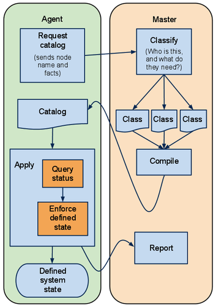

# Day 8 - 手把手系列 - 第一個 manifests

本系列文資料可參考以下：

- [Github](https://github.com/shazi7804/ops-puppet-30-days)
- [Gitbook](https://gitbook.com/book/shazi7804/puppet-manage-guide/details)
- [Mr.沙先生](https://shazi.info)

---

前七天把環境都搞定之後，終於要來開始寫 Code 了，從這個階段開始 Ops 會辛苦一點，而 Developer 會開心一點。

Puppet 是用 manifests 來管理每一個 node 要做的事情，透過 Catalog 來存放 **dependency information** 進行 deploy



Master 和 Agent 之間取得佈署清單流程：

1. Agent 傳送 catalog 內容包含 certname (節點名稱) 和 facts (由 facter  所獲取的系統參數)
1. Master 從 catalog 提供的資訊將 manifests 編譯重新打包 catalog。
1. Agent 收到 catalog 後執行佈署工作，並且回應 Report 給 Master 執行結果。

Master 和 Agent 提交的關係有：

- 由 Agent 設定的 runinterval 觸發更新
- MCollective 的 MQ (Message Queue) 更新
- 採用 random time 的方式觸發更新
- etc

在 Puppet master 上撰寫 manifests，而 manifests 是可以被即時生效，不需要 reload service。

## 建議

這個篇幅屬於可 LAB 性質，可以參考 [shazi7804/puppet-master-docker](https://github.com/shazi7804/puppet-master-docker) 來實作 Puppet code。

---


## 目標

- ubuntu.puppet.com 這台伺服器必須安裝 chrony 校時。 

## 建立 manifests

在建立 manifests 前或許你可以先查看有哪些 [resource][resource] 能夠使用，在這邊簡單利用 [package][resource-package]、[service][resource-service]、[file][resource-file] 來示範。


### Example: install chrony


```puppet
node 'ubuntu.puppet.com' {
  package { 'chrony':
    name   => 'chrony',
    ensure => present,
  }
 
  service { 'chrony':
    name   => 'chrony',
    ensure => running,
    enable => true,
  }
}
```

- 用 node 定義你的 agent certname。
- package 用來安裝套件。
- service 用來決定啟動服務與是否 ONBOOT。

### Example: install apache

```puppet
node 'ubuntu.puppet.com' {
  package { 'apache':
    name   => 'apache2',
    ensure => present,
  }
  file { ['/var/www/html','/var/www/html/agent.puppet.com']:
    ensure  => 'directory',
    owner   => 'www-data',
    group   => 'www-data',
    mode    => '700',
  }
  file { '/var/www/html/agent.puppet.com/index.html':
    content => "This puppet testing from $::fqdn",
    owner   => 'www-data',
    group   => 'www-data',
    mode    => '0400',
  }
  service { 'apache':
    name   => 'apache2',
    ensure => running,
    enable => true,
  }
}
```

- 利用 package 和 service 來安裝和啟動 Apache
- file 可以用來管理**檔案**和**目錄**
  - 用 ensure 宣告 directory 建立目錄結構與權限
  - 用 ensure 宣告 file 來管理 index.html 檔案，content 為這個檔案的內容。
- 還用到了 facts 的 fqdn 參數，這樣就能針對不同的 node 來動態給予相對的值。


這個範例也藏了小小的陷阱：
  - 實際 deploy 的時候可能會有相依性的問題 (service 觸發之前必須先 package)，這個之後會提到怎麼處理**順序性**的 resource
  - 這個案例只用 facter 來處理 fqdn，那麼如果不同的 OS 在安裝 package name 不同怎麼辦 ? 待續 ...

[resource]: https://docs.puppet.com/puppet/latest/type.html
[resource-package]: https://docs.puppet.com/puppet/latest/type.html#package
[resource-service]: https://docs.puppet.com/puppet/latest/type.html#service
[resource-file]: https://docs.puppet.com/puppet/latest/type.html#file


